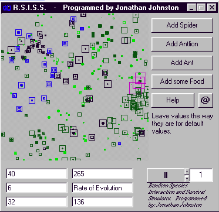

<div align="center">

## RSISS InsectSimulator by Jonathan Johnston


</div>

### Description

This is a simulation of different life forms interacting, living, dieing and evolving in the same habitat
 
### More Info
 
you input the amount of Ants, spiders, antlions, food, the rate of evolution and the refresh rate.

The code is very sloppy. I have no formal programming education, my structure is non-existant and my comments short

and you get a numerical and graphical update at the specified refresh rate

WARNING! EXTREMELY ADDICTIVE!

here you are gambling with virtual insectual lives.....MUHAHAHAHAHAAAAaaaa!


<span>             |<span>
---                |---
**Submitted On**   |2000-12-23 05:50:58
**By**             |[Jonathan D\. Johnston](https://github.com/Planet-Source-Code/PSCIndex/blob/master/ByAuthor/jonathan-d-johnston.md)
**Level**          |Intermediate
**User Rating**    |4.7 (14 globes from 3 users)
**Compatibility**  |VB 4\.0 \(32\-bit\)
**Category**       |[Games](https://github.com/Planet-Source-Code/PSCIndex/blob/master/ByCategory/games__1-38.md)
**World**          |[Visual Basic](https://github.com/Planet-Source-Code/PSCIndex/blob/master/ByWorld/visual-basic.md)
**Archive File**   |[CODE\_UPLOAD1296012222000\.zip](https://github.com/Planet-Source-Code/jonathan-d-johnston-rsiss-insectsimulator-by-jonathan-johnston__1-13805/archive/master.zip)

### API Declarations

```
theres a bunch of global types, variables and an api call.
Declare Function IntersectRect Lib "user32" (lpDestRect As RECT, lpSrc1Rect As RECT, lpSrc2Rect As RECT) As Long
Public Type Settings
 Colour As Integer
End Type
Public Type Ant
 Colour As Integer
 Strength As Integer
 Speed As Integer
 Sight As Integer
 Life As Single
 Reproduce As Integer
 X As Single
 Y As Single
 Direction As Byte
End Type
Public Type Spider
 Colour As Integer
 Strength As Integer
 Speed As Integer
 Sight As Integer
 Life As Single
 Reproduce As Integer
 X As Single
 Y As Single
 Direction As Byte
End Type
Public Type AntLion
 Colour As Integer
 Strength As Integer
 Size As Integer
 Life As Single
 Reproduce As Integer
 X As Single
 Y As Single
End Type
Public Type AntFood
 Colour As Integer
 Life As Single
 Reproduce As Integer
 X As Single
 Y As Single
End Type
Public Type RECT
 Left As Long
 Top As Long
 Right As Long
 Bottom As Long
End Type
Public Habitat As Settings
Public Ants(1001) As Ant
Public Spiders(1001) As Spider
Public AntLions(1001) As AntLion
Public Food(1001) As AntFood
Public AntOpen(1001) As Integer
Public AntOpenLength As Long
Public SpiderOpen(1001) As Integer
Public SpiderOpenLength As Long
Public AntLionOpen(1001) As Integer
Public AntLionOpenLength As Long
Public FoodOpen(1001) As Integer
Public FoodOpenLength As Long
Public AntUsed(1101) As Integer
Public SpiderUsed(1101) As Integer
Public AntLionUsed(1101) As Integer
Public FoodUsed(1101) As Integer
Public tempSortList(1101) As Integer
Public AntSightRECT(1001) As RECT
Public SpiderSightRECT(1001) As RECT
Public AntRECT(1001) As RECT
Public SpiderRECT(1001) As RECT
Public AntLionRECT(1001) As RECT
Public FoodRECT(1001) As RECT
Public tempRECT As RECT
Public AntAmount As Integer
Public SpiderAmount As Integer
Public AntLionAmount As Integer
Public FoodAmount As Integer
Public FoodUpdate As Byte
Public AntLionUpdate As Byte
Public EvolutionRate As Byte
Public SpiderDeathCount As Long
Public AntDeathCount As Long
Public FoodDeathCount As Long
Public AntLionDeathCount As Long
Public Cycles As Long
Public UpdateCount As Integer
```


